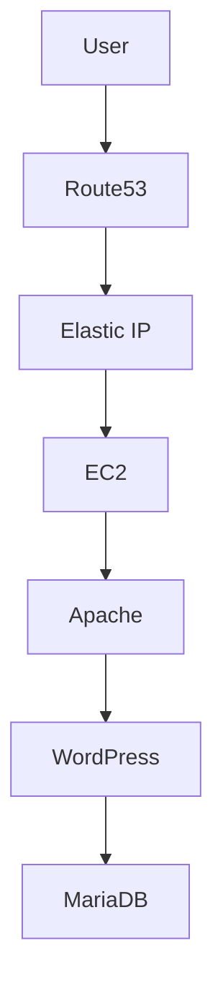

An SSL (Secure Sockets Layer) certificate is a digital file that authenticates a website's identity and enables an encrypted connection between a browser and a server
<H1>SSL certificate</H1>


<br>

```bash
sudo apt update
sudo apt install apache2
```
[Visit AWS](https://aws.amazon.com)

| Service | Purpose |
|----------|----------|
| EC2 | Host WordPress |
| Route53 | DNS |
| Elastic IP | Static IP |
| Apache | Web Server |


> [!NOTE]
> WordPress redirects to HTTPS based on Site URL.

> [!TIP]
> Test using the Elastic IP before changing Route53.

> [!IMPORTANT]
> Verify which database WordPress actually uses before creating a backup.

> [!WARNING]
> Keep the old server until the new server is fully validated.

> [!CAUTION]
> Changing DNS before testing may increase downtime.





README.md

🚀 AWS WordPress Migration

──────────────────────────────

📖 Overview

🏗 Architecture

💾 Backup

☁ AWS Infrastructure

🌍 Route53

🔒 SSL

🐳 Apache

🗄 MariaDB

🐞 Troubleshooting

📘 Lessons Learned

📚 References
